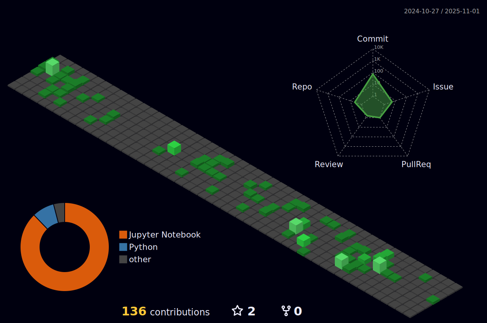

### Eduardo Lawson da Silva 

- 👨‍🎓 Automation Engineer -> Universidade Federal do Rio Grande - FURG
- 📚 Msc Computer Engineer -> Universidade Federal do Rio Grande - FURG
- 💪 Computer Vision, Deep Learning and Machine Learning.
- Some side projects too...
- 📫 How to get in touch: [Linkedin](www.linkedin.com/in/eduardo-lawson-da-silva-32b8a4224) ou [email](elawsondasilva@gmail.com) ...
- 

